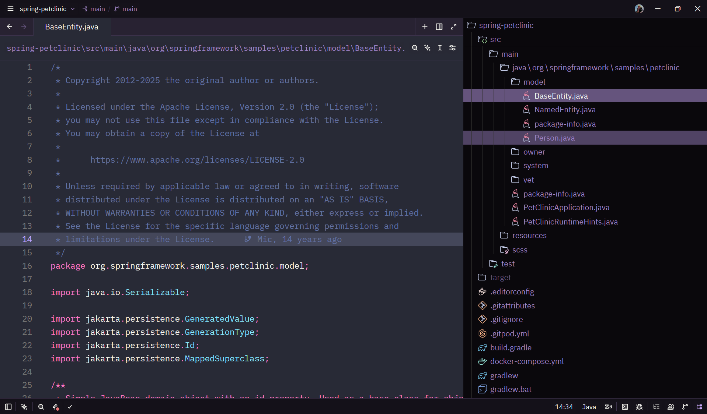
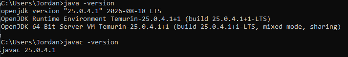
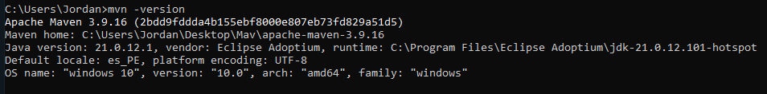
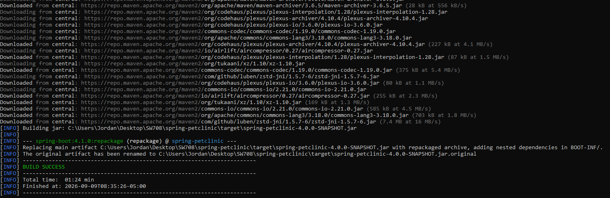
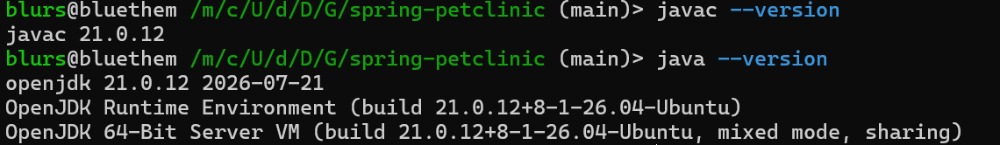
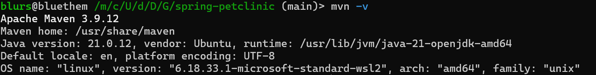
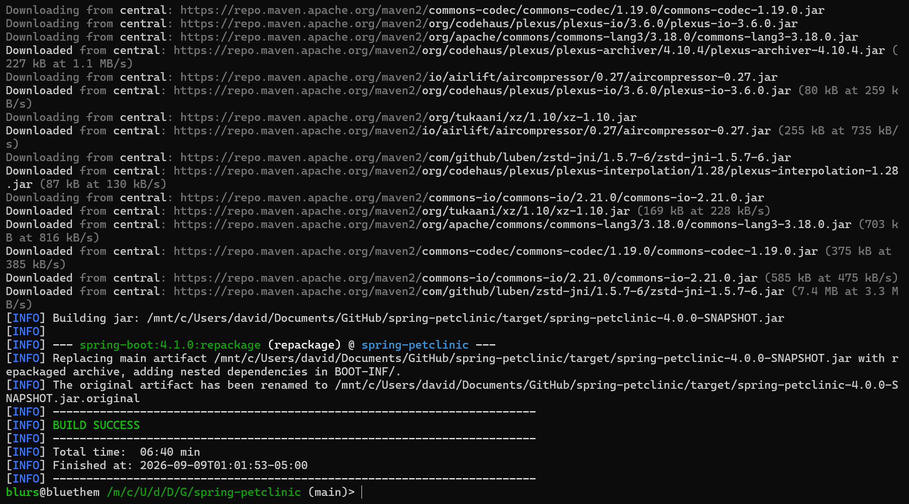
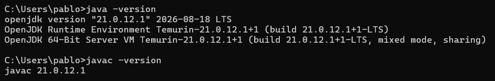
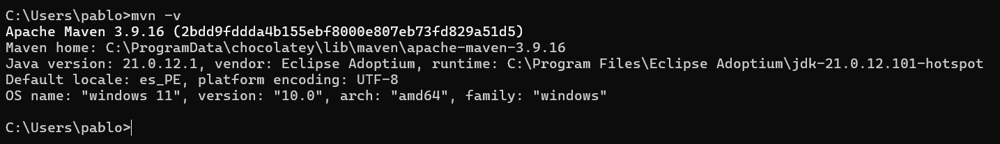
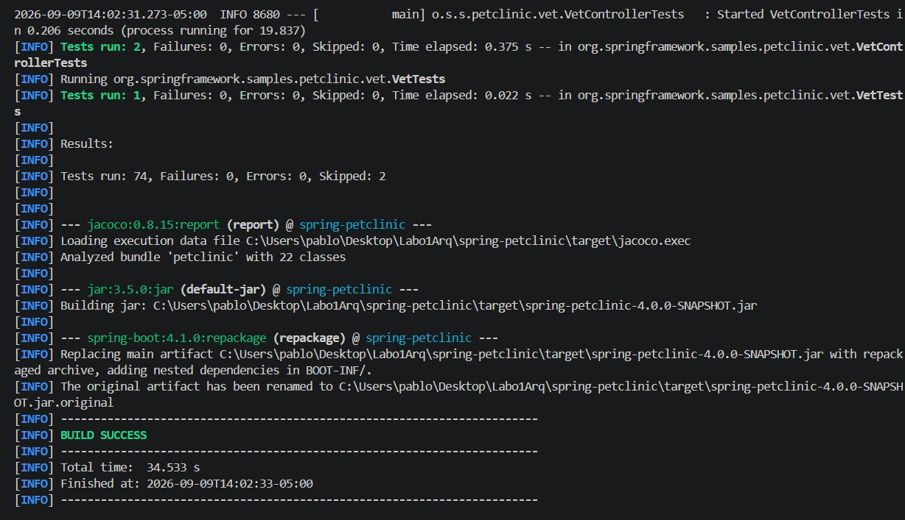

# Entorno de Configuración del Proyecto

> [!NOTE]
> Las capturas son individuales de la configuración de cada integrante del grupo.
>

---

## Paso 5: Captura del IDE

* Paso 5:

---

## Integrante 1:

--- 

## Integrante 2: Romel Rodrigo Chumpitaz Flores

* Paso 1:

* Paso 3:

* Paso 5:

---

## Integrante 3: David Luza Ccorimanya

* Paso 1:

* Paso 3:

* Paso 5:

---

## Integrante 4: 

---

## Integrante 5: 

* Paso 1: 

* Paso 3:

* Paso 5:

---
