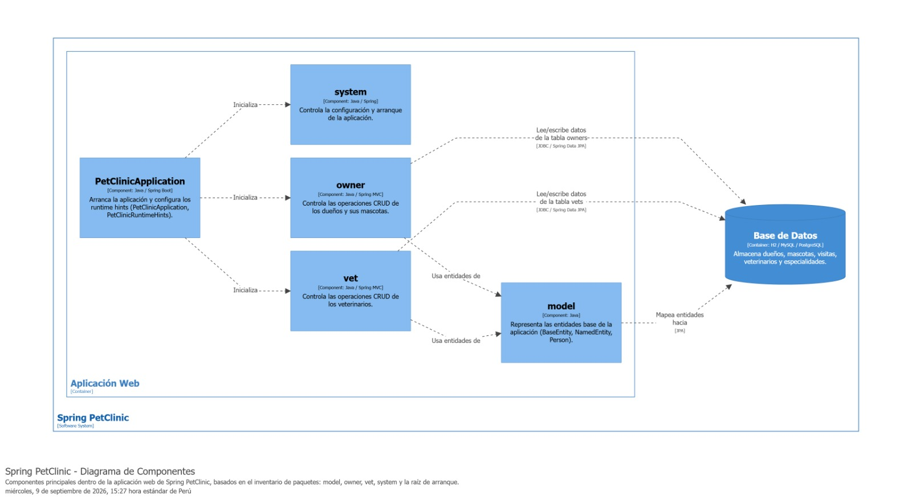

# Mapa de Componentes - Sprint Pet Clinic

## Inventario

| Paquete | Clases | Responsabilidad | Depende de |
| -- | -- | -- | -- |
| model | BaseEntity, NamedEntity, Person | Representa las entidades de la base de datos. | No tiene dependencias. |
| owner | 11 clases | Controla las operaciones CRUD de los dueños. | `model` |
| vet | 5 clases | Controla las operaciones CRUD de los veterinarios. | `model` |
| system | 4 clases | Controla la configuración y arranque de la aplicación. | No tiene dependencias. |
| (raiz) | PetClinicApplication, PetClinicRuntimeHints | Arranca la aplicación y configura los runtime hints. | Depende de `model`, `owner`, `vet`. |

## Flujo: ficha de un dueño

1. Iniciamos con la clase `OwnerController`, se encuentra el método dentro del archivo `~/src/main/java/org/springframework/sample/petclinic/owner/OwnerController.java`:

```java
@GetMapping("/owners/{ownerId}")
	public ModelAndView showOwner(@PathVariable("ownerId") int ownerId) {
		ModelAndView mav = new ModelAndView("owners/ownerDetails");
		Optional<Owner> optionalOwner = this.owners.findById(ownerId);
		Owner owner = optionalOwner.orElseThrow(() -> new IllegalArgumentException(
				"Owner not found with id: " + ownerId + ". Please ensure the ID is correct "));
		mav.addObject(owner);
		return mav;
	}
```
* Basicamente recibe el `ownerId` como parámetro y busca el dueño correspondiente en la base de datos.

2. Ahora buscamos la vista correspondiente de la tabla SQL `owners`, archivo `~/src/main/resources/db/h2/schema.sql`.

```sql
CREATE TABLE owners (
  id         INTEGER GENERATED BY DEFAULT AS IDENTITY PRIMARY KEY,
  first_name VARCHAR(30),
  last_name  VARCHAR_IGNORECASE(30),
  address    VARCHAR(255),
  city       VARCHAR(80),
  telephone  VARCHAR(20)
);
```
* La tabla `owners` contiene la información de los dueños de las mascotas.

3. Finalmente la pantalla correspondiente se encuentra en el archivo `~/src/main/resources/templates/owners/ownerDetails.html`, está renderiza el contenido de la vista de la tabla `owners`.

## Mapa de componentes



### Preguntas

**1. Si mañana piden registrar vacunas por mascota, ¿qué cajas del mapa tocarías y cuáles no?**

La caja que claramente hay que tocar es **owner**, porque ahí es donde vive todo lo relacionado a mascotas: el componente dice "Controla las operaciones CRUD de los dueños y sus mascotas", así que una vacuna pertenece a una mascota y por ende cae dentro de ese mismo componente. Habría que agregar una clase `Vaccine` parecida a como ya existe `Visit`, meterla dentro de `Pet`, crear un controlador y el formulario HTML correspondiente.

La otra caja que inevitablemente se toca es la **Base de Datos**, porque necesitaríamos una tabla nueva `vaccines` con su FK hacia `pets`, igual que como ya existe la tabla `visits`.

La caja **model** no la modificaríamos, pero sí la estaríamos usando: la clase `Vaccine` heredaría de `BaseEntity` igual que lo hace `Visit`. La flecha "Usa entidades de" que ya aparece en el diagrama aplica perfectamente para ese caso.

Las cajas que definitivamente no se tocan son **vet**, **system** y **PetClinicApplication**. Los veterinarios no tienen rol en el registro de vacunas según como está diseñado el sistema hoy, y las otras dos son infraestructura pura que no se ve afectada por agregar un nuevo concepto de negocio.

**2. De todo lo que viste hoy, ¿qué es estructural (cambiarlo obliga a cambiar muchas otras cosas) y qué es acabado (se cambia sin que nadie más se entere)? Da un ejemplo de cada uno.**

Un ejemplo de lo **estructural** es la caja **model**. En el diagrama se ve que tanto `owner` como `vet` tienen flechas "Usa entidades de" apuntando hacia ella, o sea, los dos componentes principales del sistema dependen de lo que hay ahí adentro (`BaseEntity`, `NamedEntity`, `Person`). Si alguien decide cambiar por ejemplo el tipo del campo `id` en `BaseEntity`, ese cambio lo van a sentir inmediatamente `Owner`, `Pet`, `Visit`, `Vet` y todo lo que toca la base de datos, porque todo hereda de ahí. Mueves una sola caja y el resto se sacude.

Un ejemplo de lo **acabado** son los templates HTML dentro de `owner`, como el formulario de visitas. Puedes cambiarle el estilo, renombrar una etiqueta o ajustar una validación de texto, y las cajas `vet`, `model` o `system` del diagrama no se enteran para nada. Es un detalle que vive dentro de una sola caja y no cruza hacia ninguna otra.
