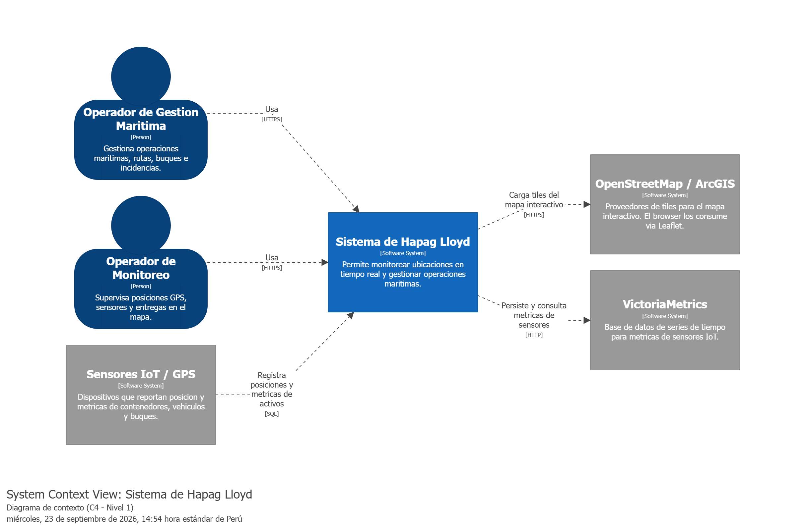
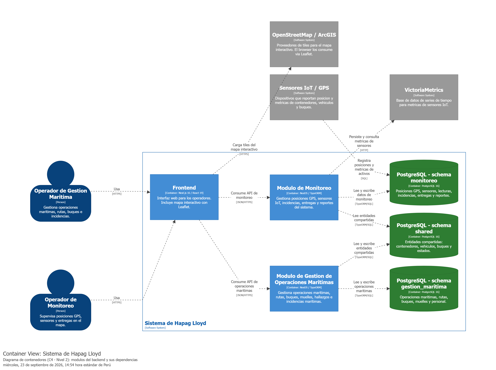

# Leyenda del modelo C4 — Sistema de Hapag Lloyd

## 1. Qué muestra cada figura

### Contexto (C4 - Nivel 1)



Muestra el sistema completo como una sola caja y su relación con el mundo exterior. Se identifican dos roles de usuario: el **Operador de Gestión de Operaciones Marítimas**, que gestiona rutas, buques e incidencias; y el **Operador de Monitoreo**, que supervisa posiciones GPS y sensores en el mapa. Los sistemas externos son **OpenStreetMap / ArcGIS** (proveedor de tiles de mapa consumidos directamente desde el browser), **VictoriaMetrics** (base de datos de series de tiempo para métricas de sensores IoT) y **Sensores IoT / GPS** (dispositivos que reportan posición y métricas de activos).

---

### Contenedores (C4 - Nivel 2)



Abre el sistema y muestra las piezas que se ejecutan o almacenan datos de forma separada. El **Frontend** (Next.js 16 / React 19) es la interfaz web con mapa interactivo vía Leaflet. Dentro del backend existen dos módulos NestJS desplegados en el mismo proceso: el **Módulo de Monitoreo** y el **Módulo de Gestión de Operaciones Marítimas**. El almacenamiento está en un único servidor **PostgreSQL 16** organizado en tres schemas: `monitoreo`, `shared` y `gestion_maritima`, representados como contenedores separados por ser dominios de datos independientes.

---

### Componentes del Módulo de Monitoreo (C4 - Nivel 3)


Abre el **Módulo de Monitoreo** y muestra las seis responsabilidades internas que lo componen:

- **Seguimiento de Posiciones**: consulta posiciones GPS de contenedores, vehículos y buques almacenadas en la BD.
- **Gestión de Operaciones**: supervisa el ciclo de vida de las operaciones de monitoreo y el estado de los activos.
- **Vigilancia de Sensores IoT**: registra lecturas de sensores, genera notificaciones internas y persiste métricas en VictoriaMetrics.
- **Gestión de Incidencias**: registra y gestiona incidencias con severidad y estado.
- **Trazabilidad de Entregas**: gestiona la entrega de contenedores a importadores con documentación asociada.
- **Reportes**: genera reportes consolidados de incidencias, notificaciones y operaciones.

---

## 2. Qué se dejó afuera a propósito

El sistema real contiene otros módulos NestJS (`auth`, `gestion_portuaria`, `gestion_reserva`, `operaciones_terrestres`, `personal_tripulacion`) que **no se modelaron** porque el análisis de esta semana se enfoca únicamente en los módulos de **Monitoreo** y **Gestión de Operaciones Marítimas**. Incluirlos habría agregado ruido al diagrama sin aportar al objetivo del ejercicio.

El módulo de **Autenticación** (`auth`) tampoco aparece como contenedor porque, aunque existe en el backend y todos los endpoints lo usan, es una dependencia transversal y no una pieza con dominio de datos propio que aporte al análisis de los dos módulos seleccionados.

Los schemas `gestion_portuaria` y `gestion_reserva` de PostgreSQL se omitieron por la misma razón.

---

## 3. Observaciones del equipo revisor

> [!NOTE]
> Feedback del equipo 1 (CineStar Barrio)

# Feedback de diagramas C4 — Semana 03 (sw708-equipo-3)

## Nivel 1 — Contexto

Bien resuelto y minimalista, que es justo lo que un diagrama de contexto debe ser: 2 personas, 3 sistemas externos, 1 sistema principal, relaciones implícitas activadas (`!impliedRelationships true`). No hay ruido visual. Nada que corregir aquí.

## Nivel 2 — Contenedores

Este es el diagrama que más atención necesita.

Con `include *` se agrupan en una sola vista: 2 personas + 3 sistemas externos + 5 contenedores del sistema (frontend, 2 módulos, 3 bases de datos) + ~13 relaciones. Con `autoLayout lr` (izquierda-derecha) y esa cantidad de nodos, Structurizr va a tender a generar líneas largas y cruzadas.

**Problema principal:** la relación

```
sensoresIoT -> dbMonitoreo "Registra posiciones y metricas de activos" "SQL"
```

entra desde afuera del sistema directo a un contenedor interno, sin pasar por ningún módulo del backend. Visualmente esa flecha va a "saltarse" el resto del diagrama y cruzar por encima de otras cajas.

| Modelo actual | Alternativa sugerida |
|---|---|
| `sensoresIoT -> dbMonitoreo` (salta el backend) | `sensoresIoT -> vigilanciaSensores -> dbMonitoreo` (pasa por el componente que ya existe para esto) |

Si en el código el sensor realmente escribe directo a Postgres, vale la pena confirmarlo — es poco común y rompe la convención C4 de que un sistema externo interactúa con el sistema a través de uno de sus contenedores.

**Otros puntos sobre esta vista:**

- **Demasiadas relaciones en una sola vista.** Con 13+ flechas entrando y saliendo de las 3 bases de datos, el diagrama se va a leer denso. Considera una vista adicional solo de "flujo de aplicación" (personas → frontend → módulos → sistemas externos, sin las bases de datos) y dejar el acceso a datos como detalle aparte.
- **Probar `autoLayout tb`** (top-bottom) en vez de `lr` para esta vista. Con personas arriba, frontend debajo, módulos debajo de eso y bases de datos al final, el flujo natural es vertical — normalmente da menos cruces que forzar todo de izquierda a derecha con 10 nodos.
- `dbShared` recibe flechas de ambos módulos backend desde direcciones distintas; si Structurizr lo dibuja feo, se puede fijar su posición manualmente en el centro-abajo para que ambas flechas entren limpias.

## Nivel 3 — Componentes (Módulo de Monitoreo)

Los 6 componentes son claros y están bien delimitados por responsabilidad. El único riesgo visual: 5 de los 6 componentes apuntan a `dbMonitoreo`, generando un patrón de "abanico" convergiendo en una sola caja.

Es aceptable en un diagrama de componentes (refleja lo que realmente pasa en el código), pero si se ve muy saturado al renderizarlo en Structurizr, vale la pena evaluar si conviene aceptar el abanico tal cual (es honesto con el código) o buscar una forma de agrupar visualmente esas líneas.

## Notación y estilo (bien logrado)

- Los colores siguen la convención C4 estándar: persona en azul oscuro, sistema externo en gris, contenedor en azul medio, componente en azul claro, base de datos en verde con forma de cilindro. Consistente y fácil de leer.
- El uso de la forma `Cylinder` para las bases de datos es el detalle correcto que mucha gente olvida — ayuda a diferenciar contenedores de aplicación vs. de datos de un vistazo.

## Resumen accionable

El **modelo** (contenido) está sólido. El ajuste pendiente es de **legibilidad visual**:

1. Separar la vista de contenedores en 2: flujo de aplicación / acceso a datos.
2. Probar `autoLayout tb` en el diagrama de contenedores.
3. Decidir qué hacer con la flecha directa `sensoresIoT -> dbMonitoreo` que cruza el diagrama (¿es real en el código, o debería pasar por `vigilanciaSensores`?).

---

## 4. Observación del equipo

Al dibujar el diagrama de componentes del **Módulo de Monitoreo** se notó que el componente de **Vigilancia de Sensores IoT** es el único que tiene una dependencia directa hacia un sistema externo (VictoriaMetrics) además de la base de datos. Esto significa que si VictoriaMetrics no está disponible, solo ese componente se ve afectado: los demás cinco componentes del módulo siguen operando con normalidad sobre PostgreSQL. Esta separación no era evidente leyendo el código directamente — solo se hizo visible al forzar que cada componente declarara sus propias dependencias en el diagrama.
